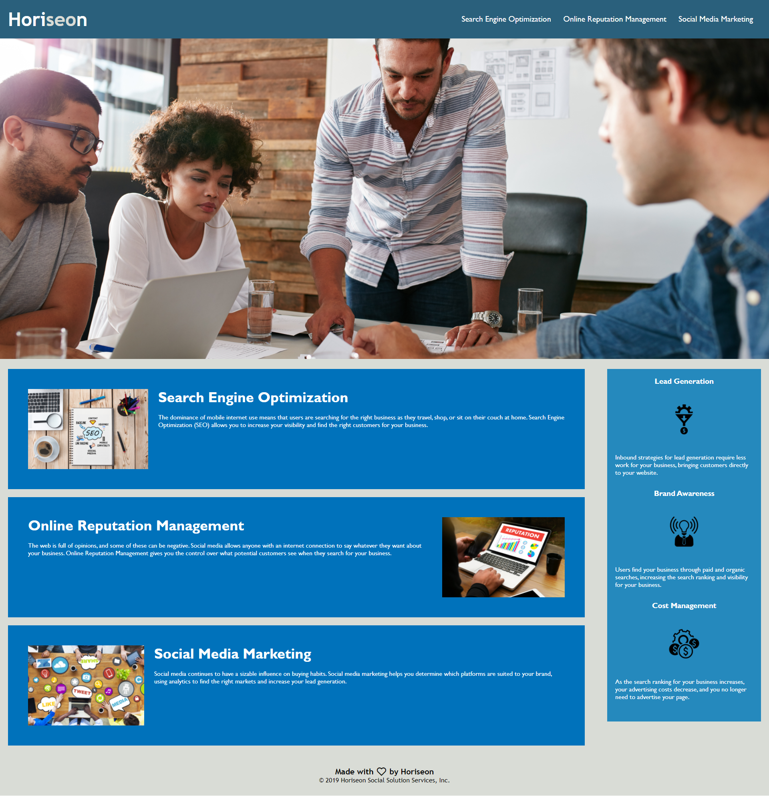

# 01 HTLM, CSS and Git: Code Refractor

## Description

The new Horiseon website that meets accessibility standards and has semantic HTML elements. I updated the images to contain descritive alt tags as a free service.

## Screenshot

## Links to Application

- Here is the link: [coconnor10/hw1b](https://github.com/coconnor10/hw1b)
- Here is the pages [coconnor10/pages](https://coconnor10.github.io/hw1b/)
